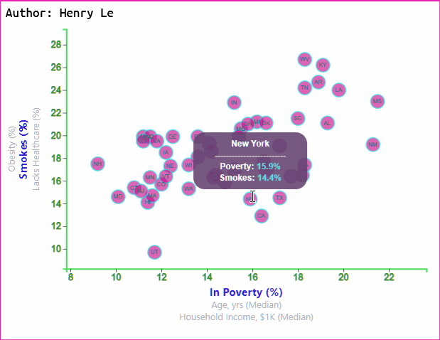

# The American Dream
# 1. Background
Everyone has their own definitions of and goals towards this dream & what makes them happy. But have we all achieved this dream, how are we doing? Interesting questions. In this project, the 2014 American Community Survey (ACS) dataset is visualized & analyzed to reveal some of the key insights about the current status across all 50 states in the U.S.A.

By visualizing data, the relationship between different contributing factors to the nation prosperity & human health is to be revealed.

## Features Overview
### 6-Axis Rendered Simulatneously with Dynamic Data Analysis
<div align="center">
    
</div>

### Tooltips upon Mouse Hovering
<div align="center">
    
</div>


# 2. Dataset
2014 ACS with key parameters including:
* In Poverty (%)
* Age (Median)
* Household Income, $ (Median)
* Obesity (%)
* Smokes (%)
* Healthcare Coverage(%)

# 3. Web Deployment
Deployed thru GitHub IO and can be accessed <a href="https://henryle-n.github.io/The-American-Dream/
">here</a>.

# 4. Languages, Tools & Techniques
* **Languages:**
    * HTML | CSS | JavaScript | Markdown
* **Libraries & Modules:**
    * Scalable Vector Graphics (SVG)
    * D3.js
* **Features:**
    * Dynamic linear-Scaling
    * Multi-axis rendering
    * Scatter Plot with Circle-SVG
    * Tooltips
* **Software & Apps:**
    * Visual Studio
* **Operating System:**
    * Windows 10 Pro, ver. 1909

# 5. Highlights post-Data-Analysis
* TX has the highest uninsured people which occupies 25% of its total population.
* 25% of West Virginia population smokes.
* 36% of Arkansas population is obese.
* Highest poverty % associates with ages ranging from 35 to 41 years-old.
* The lowest income per household belongs to Mississippi, which cap at $40,000/year.

# 6. How to Use
* This repository contains all data and codes needed to run the application. A similar dataset can be utilized for the source code developed. As new dataset is used, changed axis titles & ids so D3 DOM data binding can work properly.
* To clone, do:
    * ```git clone https://github.com/henryle-n/The-American-Dream.git```

# 7. Lesson Learned
* All data have to be pulled from a single data source, either a CSV or a JS Object.
* All features on the same axis must have the same dimensions (i.e. same amount of data rows). Otherwise, the extra datapoints won't get rendered.
* When an axis has multiple categories or features, it'd be best to create axis group to manage all of them efficiently and minimize formating issues.
* SVG can be easily made responsive by applying CSS formats, which helps chart to resize with different screen resolutions.
* D3 data binding is simple yet powerful. It helps simplifying code syntax comparing to "_Vanilla JS_".
