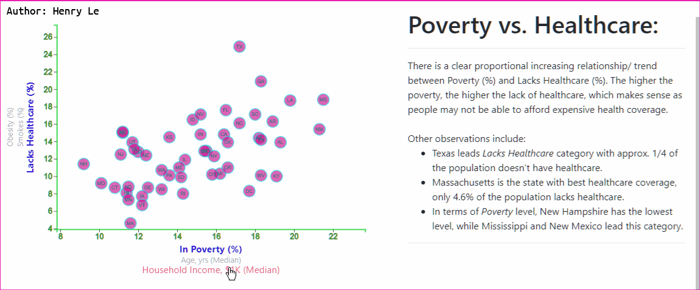

# The American Dream
Everyone has their own definitions of and goals towards this dream & what makes them happy. But have we all achieved this dream, how are we doing? Interesting questions. In this project, the 2014 American Community Survey (ACS) dataset is visualized & analyzed to reveal some of the key insights about the current prosperity & living standards across all 50 states in the U.S.A.

    

# Dataset
2014 ACS key parameters include:
* In Poverty (%)
* Age (Median)
* Household Income, $ (Median)
* Obesity (%)
* Smokes (%)
* Healthcare (%)
* 
https://henryle-n.github.io/D3-Challenge/
